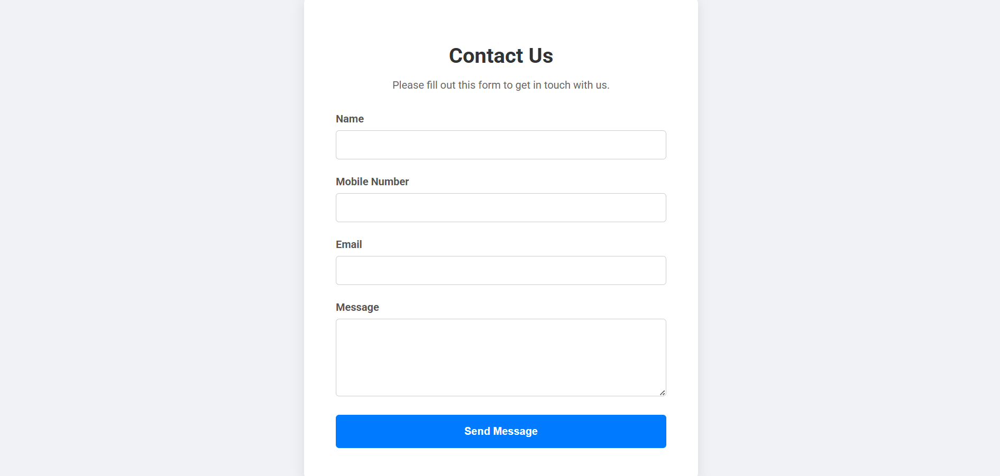

# Contact Form with Client-Side Validation

This project is a simple, modern contact form that demonstrates key front-end development skills, including form handling and client-side input validation. The form is built using standard HTML, styled with CSS, and validated with vanilla JavaScript.

### 🎯 Objective

The main goal of this project is to build a robust contact form that provides immediate and helpful feedback to the user. This is a crucial step in ensuring a good user experience and is a fundamental skill for any web developer.

### ✨ Features

- **Responsive Design**: The form is designed to look good and be easy to use on both desktop and mobile devices.
- **Input Fields**: Includes fields for Name, Email, Mobile Number, and Message.
- **Client-Side Validation**: All inputs are validated in real-time using JavaScript.
  - **Non-empty fields**: Ensures that no field is left blank.
  - **Email Format**: Validates the email address using a regular expression to check for a correct structure.
  - **Mobile Number**: Ensures the mobile number is exactly 10 digits.
- **User Feedback**:
  - **Error Messages**: Clear error messages are displayed under each input field if validation fails.
  - **Success Message**: A success message appears upon a valid submission.
- **No Server Required**: The validation logic runs entirely in the browser, demonstrating pure front-end functionality.

### ⚙️ Getting Started

To view and test this project, simply download the files and open the `index.html` file in your web browser.

### 📂 File Structure

The project consists of three main files:

- `index.html`: The HTML structure of the contact form.
- `style.css`: The CSS code for styling the form and its elements.
- `script.js`: The JavaScript code for all the validation logic and user feedback.

### 📝 How It Works

The validation is handled by an event listener on the form's `submit` event. When the user clicks the "Send Message" button, the JavaScript function is triggered. It checks each input field against a set of rules (e.g., is it empty? does the email match the regex?). If any validation fails, an error message is displayed, and the form submission is prevented using `event.preventDefault()`. If all fields are valid, a success message is shown.

### OUTPUT

d
